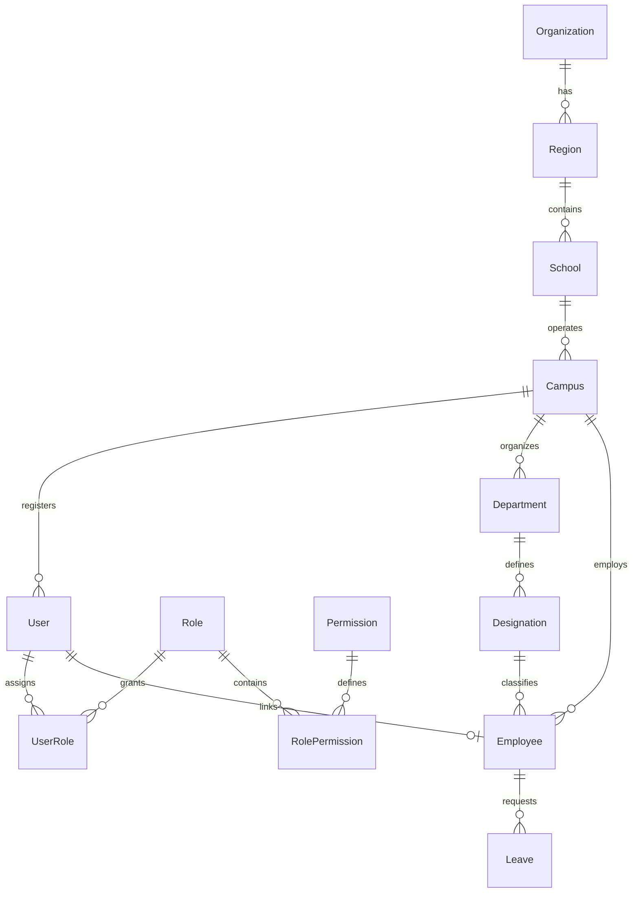
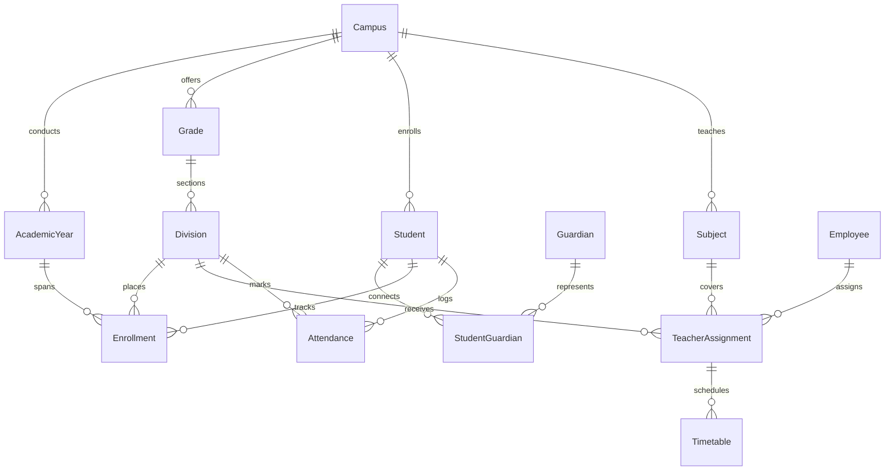
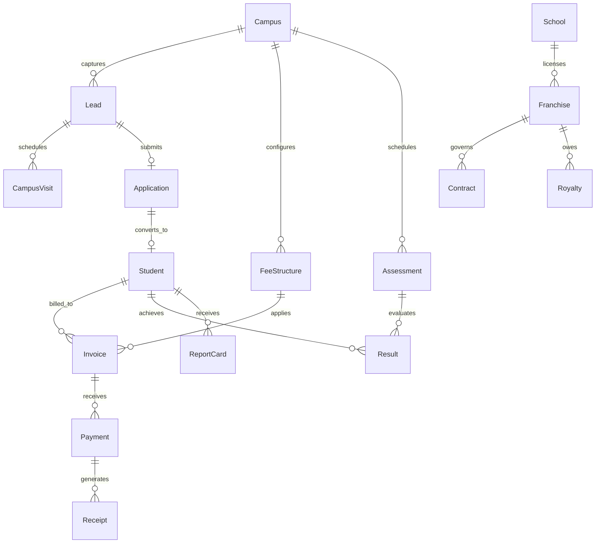
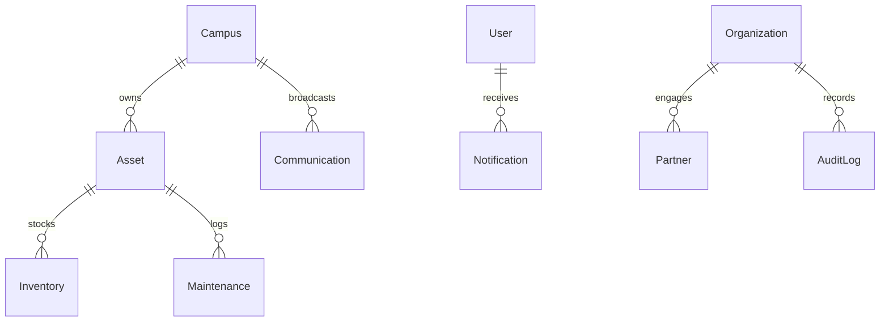

# 01 — Entity Relationship Diagram (ERD): VEDIC TREE OS

## 1. Domain Groupings & Architecture Overview

The VEDIC TREE OS database is structured into 8 cohesive domain boundaries centered around a multi-tier tenant model:
1. **Tenancy & IAM**: Organization, Region, School, Campus, User, Role, Permission, UserRole.
2. **Staff & HRMS**: Employee, Department, Designation, Leave, Policy.
3. **Student & Guardian SIS**: Student, Guardian, StudentGuardian, Enrollment, AcademicYear, Grade, Division.
4. **Academics & Timetables**: Subject, TeacherAssignment, Timetable, Attendance.
5. **Admissions CRM**: Lead, Application, CampusVisit, Workflow.
6. **Finance & Billing**: FeeStructure, Invoice, Payment, Receipt, Franchise, Contract, Royalty.
7. **Examinations & Progress**: Assessment, Result, ReportCard.
8. **Operations & Governance**: Event, Activity, Asset, Inventory, Maintenance, Communication, Notification, Partner, AuditLog.

---

## 2. Mermaid Entity Relationship Diagrams

### 2.1 Core Tenancy, IAM & HRMS Structure

### 2.2 Student Information System (SIS) & Academics

### 2.3 Admissions CRM, Finance & Examinations

### 2.4 Logistics, Operations & Auditing

