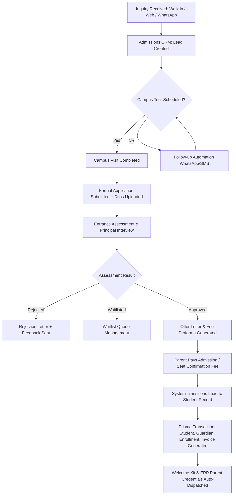
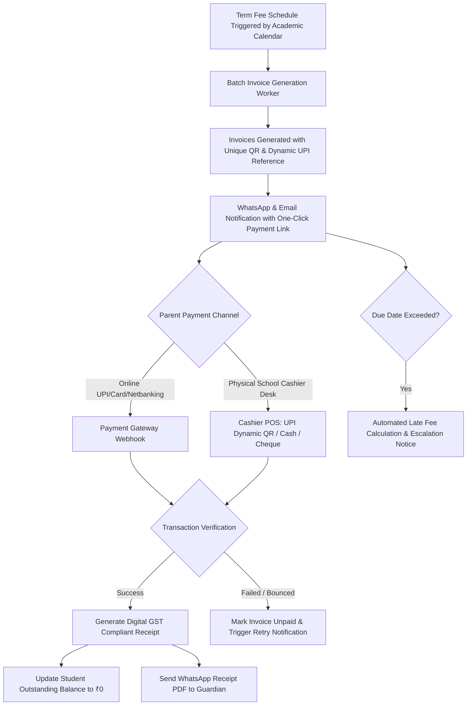
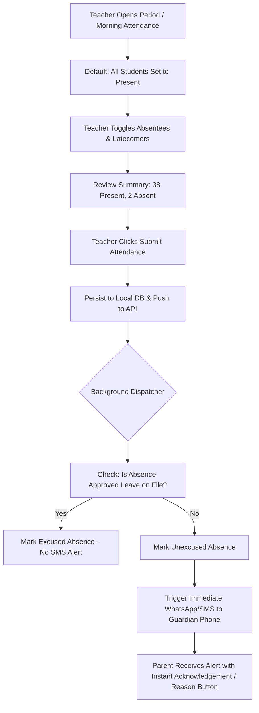
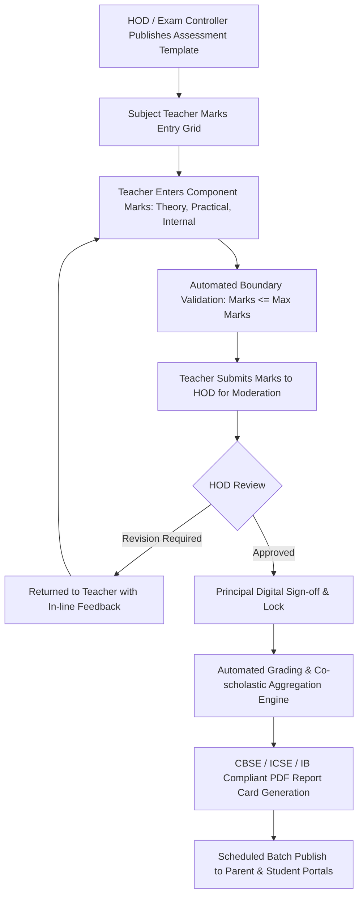

# 05 — Critical User Flows & State Machines: VEDIC TREE OS

## 1. Flow 1: Complete Admission Lifecycle Flow

From initial walk-in / online inquiry to enrolled student with generated invoice.

---

## 2. Flow 2: Automated Fee Invoicing and Payment Flow

---

## 3. Flow 3: Student Attendance & Parent Automated Alert Flow

---

## 4. Flow 4: Exam Marks Entry, Moderation & Report Card Publishing

